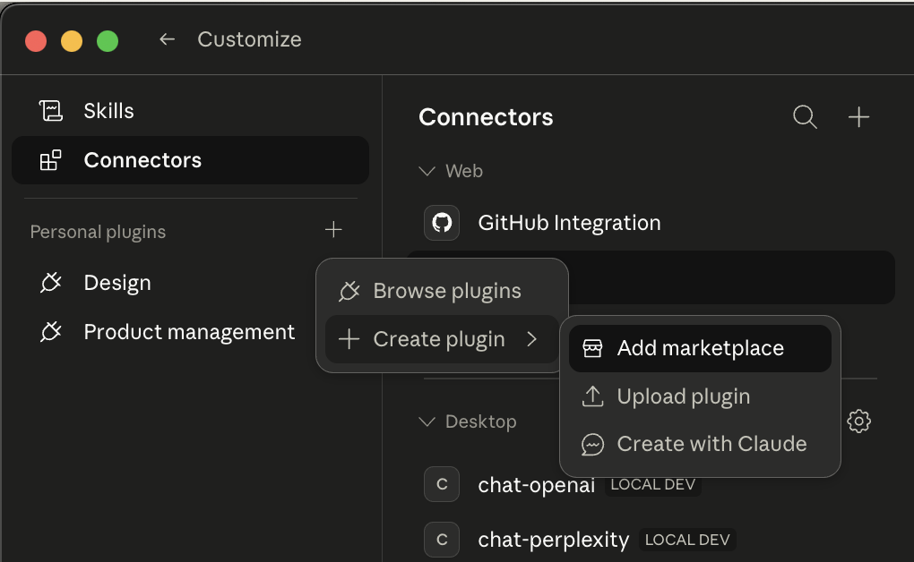
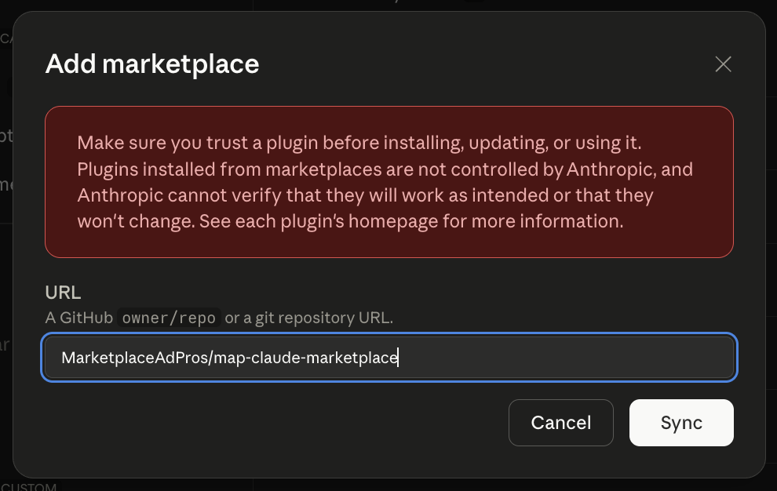

# Amazon Plugin for Claude

Manage and optimize your Amazon Advertising and Selling Partner accounts through Claude using the [Marketplace Ad Pros](https://marketplaceadpros.com?ref=github-map-claude-marketplace) MCP server.

## Skills

This plugin includes three skills:

| Skill | Invoke | Description |
|-------|--------|-------------|
| **Amazon Ads** | `/amazon:amazon-ads` | Browse campaigns, analyze performance reports, get bid/budget/keyword recommendations |
| **Optimization** | `/amazon:amazon-ads-optimization` | Campaign optimization playbook — five-pillar framework, bid strategy, negative keywords, seasonal prep |
| **Seller Central** | `/amazon:amazon-seller-central` | Seller Central & Vendor Central insights — inventory, fees, sales, search, vendor metrics |

## Prerequisites

1. A [Marketplace Ad Pros](https://marketplaceadpros.com?ref=github-map-claude-marketplace) account with your Amazon accounts connected.
2. This plugin auto-configures the MCP server connection via `.mcp.json`. No manual MCP setup needed.

See [full integration instructions](https://marketplaceadpros.com/integrations/?ref=github-map-claude-marketplace) for details on connecting your Amazon accounts.

## Install

### Claude Desktop

1. Open Claude Desktop and go to **Customize** (bottom-left).
2. Next to **Personal plugins**, click the **+** button.
3. Select **Create plugin** > **Add marketplace**.



4. Enter `MarketplaceAdPros/map-claude-marketplace` as the URL and click **Sync**.



5. The Amazon plugin and its skills will be available in your plugins list.

### Claude Code

```bash
claude plugin install amazon --url https://github.com/MarketplaceAdPros/map-claude-marketplace --path plugins/amazon
```

### Development / Testing

```bash
claude --plugin-dir ./plugins/amazon
```
